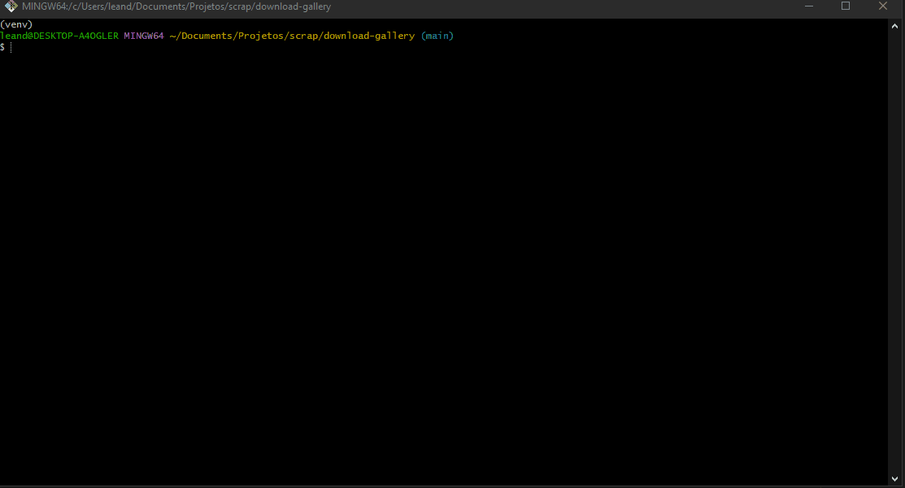

# Download Gallery

#### 1. Fazer download e instalação do [Python](https://www.python.org/downloads/)
#### 2. Rodar o comando no terminal `pip install -r requirements.txt`
#### 3. Rodar o comando no terminal `python scrapping.py`
#### 4. Após rodar esse comando vai aparecer no terminal a opção de adicionar o link do deviant
#### 5. Após o link ser adicionado o download começará a ser feito no diretório que vai aparecer no próprio terminal e vai ser dividido por nome de usuário e galeria, por exemplo "leandro/dragonball"
